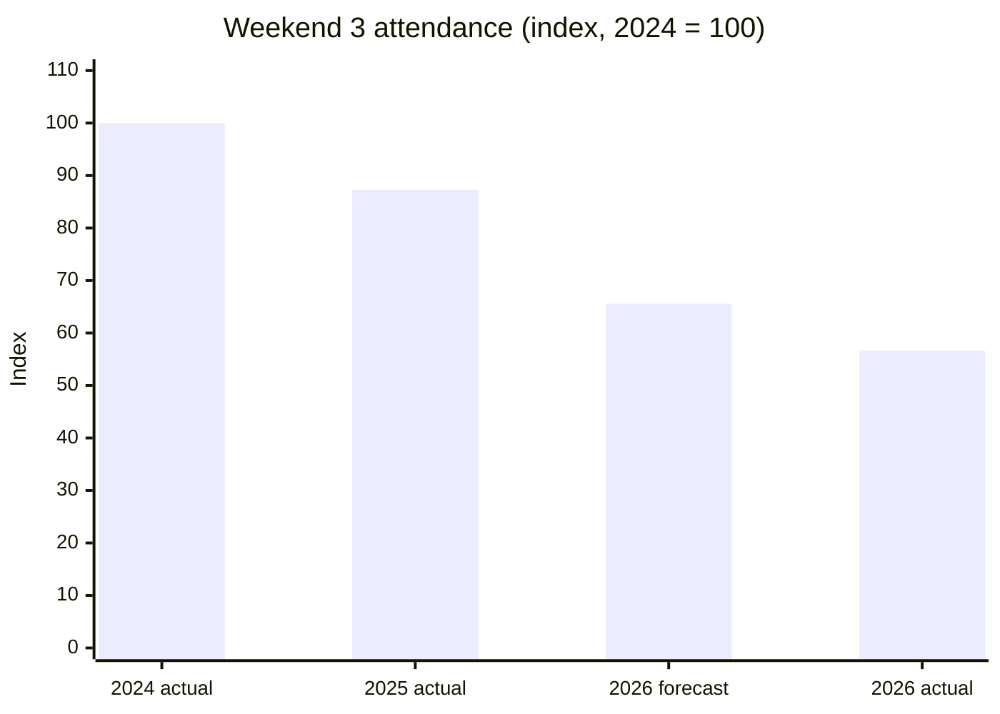
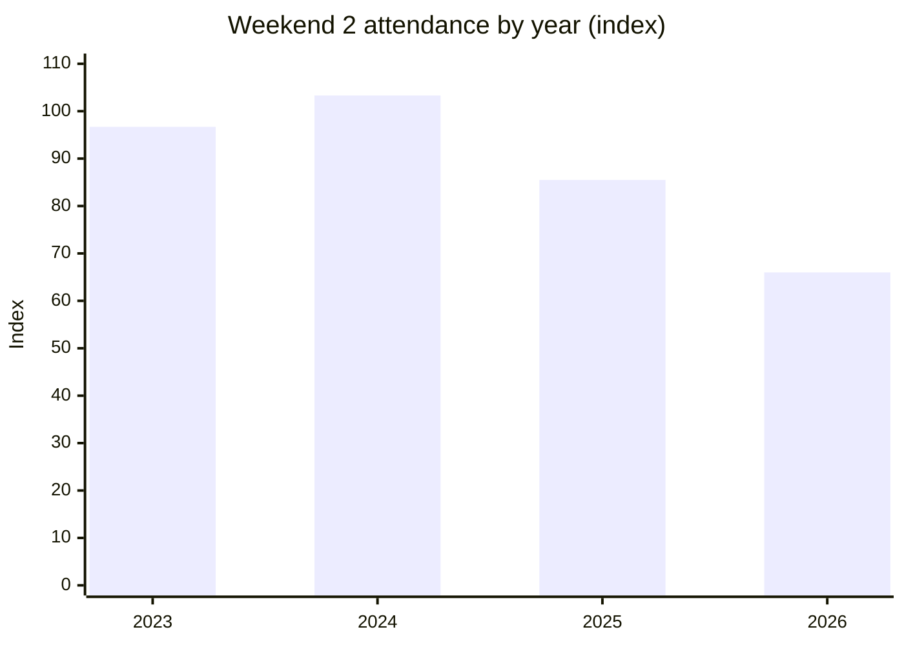

# Night Festival attendance: analysis and a forecast checked against reality

An Excel analysis of Friday and Saturday attendance at Children's Museum Singapore during the Singapore Night Festival (2023–2026). It includes a **pre-event forecast for 2026 Weekend 3** that I froze before the event and then **evaluated against actual attendance**.

> **Personal side project,** not an official museum forecast or operational target.
> **Attendance is shown as an index** (2024 Weekend 3, Friday + Saturday = **100**), so the museum's real visitor counts aren't published. Ratios, shares and % errors are exactly the same as in the original analysis.

## Result at a glance

I built three forecasting models on data up to 2026 Weekend 2, chose one, and froze it on **1 Sept 2026**. When the actual Weekend 3 attendance came in:

| Model | 2026 W3 forecast (index) | Error vs actual (56.6) |
|---|---|---|
| 1. Weekend 3 ÷ Weekend 2 ratio | 66.7 | +17.8% |
| 2. Year-to-date scaling | 75.3 | +33% |
| **3. Historical share pattern (selected)** | **65.6** | **+15.9%** |

- **The selected model was the most accurate of the three**, but it still over-forecast by **15.9%**.
- **About 90% of that error came from Friday.** Saturday was almost exactly right (37.5 forecast vs 36.6 actual).

## Business questions and findings

| # | Question | Finding |
|---|---|---|
| 1 | How is 2026 performing against comparable weekends? | **Down.** 2026 Weekend 2 was the lowest of the four years: −22.9% vs 2025 and −36.2% vs the 2024 peak. Weekend 3 came in 35% below 2025. |
| 2 | Are Saturdays consistently busier than Fridays? | **No.** On Weekend 2, Friday led in 2023 and 2024. Since 2025, Saturday has led on every weekend. |
| 3 | Which festival weekend draws the most? | Among complete weekends, **Weekend 2** was the busiest in 2023, 2024 and 2026, and Weekend 3 was narrowly the busiest in 2025. |
| 4 | What's the trend from 2023 to 2026? | Weekend 2 peaked in 2024 and has fallen since. **The fall is almost all Friday**: Weekend 2 Friday went from 55.1 to 21.0, while Saturday held at 42–55. |
| 5 | What should we expect for 2026 Weekend 3? | Forecast **65.6** (Friday 28.1, Saturday 37.5), frozen before the event. |
| 6 | How accurate was it? | **+15.9%** over, and 90% of the miss was on Friday (see below). |

## Method

All three models use only the data available before Weekend 3, with the 2024–2025 festivals as history.

1. **Weekend 3 ÷ Weekend 2 ratio:** the average W3/W2 ratio for each day, applied to 2026 Weekend 2.
2. **Year-to-date scaling:** 2026 attendance through Weekend 2 as a share of 2025's, applied to 2025 Weekend 3.
3. **Historical share pattern (selected):** Weekend 2 has made up about 50% of the combined Weekend 2 + 3 total. From 2026 Weekend 2, this gives the expected total, which is then split by the average Friday and Saturday shares. I chose it because it uses both days of the latest weekend and the full Weekend 2-to-3 pattern, rather than a single day or last year alone.

## Why the forecast missed, and what I'd change

The model used Friday's average share from 2024 and 2025 (22.2% and 20.5% of the Weekend 2 + 3 total). But 2026 Fridays ran far lower: the actual share was **16.3%**. Fridays have been falling for two years while Saturdays held steady, and averaging in 2024, a strong Friday year, pulled the Friday forecast up.

**Next time:**
- Weight recent years more heavily.
- Model Friday and Saturday trends separately. Model 1 did that per day and was far closer on Friday, even though it was worse on Saturday.

## Limitations

- **Only two past years** (2024 and 2025) have a complete Weekend 3, so every model rests on n = 2.
- **Gaps in the data:** 2024 Weekend 1 Friday is missing, and 2023 has Weekends 1–2 only. Comparisons use matching Friday/Saturday observations only.
- **Things the data doesn't capture:** weather, programming, promotions and capacity limits all affect attendance.

## Files

| File | What's in it |
|---|---|
| [`night_festival_forecast_indexed.xlsx`](night_festival_forecast_indexed.xlsx) | The workbook: indexed data, the three models as live Excel formulas, the forecast-vs-actual evaluation, and charts. |
| [`attendance_indexed.csv`](attendance_indexed.csv) | The indexed data, readable directly on GitHub. |

**Built with:** Excel (SUMIFS, AVERAGE and charts). The original analysis also used PivotTables. This published copy was rebuilt with indexed values, so the real counts aren't kept inside the file.

README and indexed workbook prepared with help from Claude. The analysis, models and forecast are my own.
